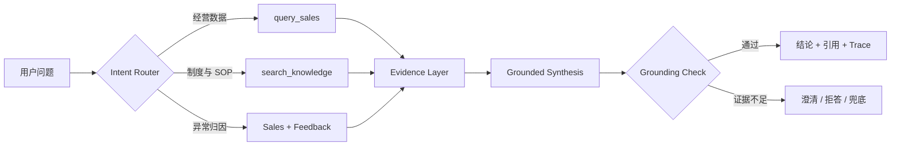

# NovaMed AI Business Copilot

> 一个真正可运行、可追溯、可评测的企业经营分析 Agent。它把结构化销售数据、业务一线反馈和企业知识库串成一条完整证据链，支持数据查询、异常归因和经营复盘。

[](https://www.python.org/)
[](benchmark/benchmark_120.json)
[](LICENSE)

**Important / 重要说明：** NovaMed、产品、机构、销量与业务反馈均为固定随机种子生成的虚构数据，不含任何真实公司、客户、患者或雇主信息。项目不提供医疗建议。

## 先看 Demo

无需 API Key，克隆后即可运行本地 Agent：

```bash
python demo.py "本周全国 NovaScan 销量怎么样？"
python demo.py "哪个区域下降最多？"
python demo.py "华东为什么下降？"
python demo.py "新品机构授权规则是什么？"
python demo.py "帮我生成本周经营复盘。"
```

每次回答都会返回：

- `answer`：包含证据引用的业务结论
- `route`：本次任务走的数据、知识或综合分析路径
- `tool_calls`：工具名、参数、状态和耗时
- `sources` / `citations`：使用到的 CSV 行或知识库章节
- `trace`：路由、工具执行、Grounding Check 的完整轨迹
- `confidence`：基于证据充分度的置信度，而不是“模型自我感觉”

## 它为什么是 Agent，而不只是聊天机器人

大模型不直接“猜”销售数字或企业制度。系统先判断任务，再执行受约束的业务工具，并在输出前检查证据：



| 能力 | 实现方式 | 示例 |
|---|---|---|
| 动态经营查询 | Tool Calling + CSV 聚合 | 全国销量、区域对比、产品表现、Top 机构 |
| 企业知识问答 | 可解释的 Markdown RAG | 新品授权、机构分级、商业复盘 SOP |
| 异常归因 | 销售 Tool + 一线反馈 Tool | “华东为什么下降？” |
| 自动复盘 | 多步骤 Workflow | 趋势 → 异常 → 机构 → 反馈 → Action Items |
| 风险控制 | Source Citation + Grounding Check | 无依据时明确说明证据不足 |
| 可观测性 | JSON Trace | 路由、参数、工具耗时、来源、置信度 |
| 效果评测 | 120 条离线 Benchmark | Routing、Retrieval、Tool、参数、完成率、时延 |

## 两种运行模式

### 1. Local mode（默认）

完全离线、确定性运行，不需要模型账号。适合面试演示、回归测试和复现评测结果。

```python
from app.agent import BusinessCopilot

agent = BusinessCopilot(mode="local")
result = agent.chat("华东为什么下降？", session_id="demo-user")
print(result["answer"])
print(result["tool_calls"])
```

### 2. OpenAI mode（可选）

使用 Responses API 做工具选择与证据归纳；结构化数字仍由本地工具计算，制度事实仍来自本地知识库。实现遵循官方的 [function calling 流程](https://developers.openai.com/api/docs/guides/function-calling)。

```bash
export OPENAI_API_KEY="your_key_here"
export OPENAI_MODEL="gpt-5-mini"
export COPILOT_MODE="openai"
python demo.py --mode openai "华东为什么下降？"
```

API Key 只从环境变量读取，不写入仓库。若 SDK、网络或 API 暂时不可用，Agent 会记录原因并回退到有证据约束的本地路径。

## 安装与界面

```bash
python -m venv .venv
source .venv/bin/activate
python -m pip install -r requirements.txt

# Streamlit 对话界面
streamlit run frontend/streamlit_app.py

# FastAPI（Swagger: http://127.0.0.1:8000/docs）
uvicorn api.main:app --reload
```

也可以用 Docker：

```bash
docker build -t novamed-copilot .
docker run --rm -p 8501:8501 novamed-copilot
```

## 真实可复现的 120 条评测

Benchmark 不是 README 里的装饰数字。`benchmark/benchmark_120.json` 包含以下固定分布：

| Case 类型 | 数量 |
|---|---:|
| Knowledge / RAG | 25 |
| 数据查询 | 30 |
| Tool 参数抽取 | 20 |
| 综合经营分析 | 25 |
| 无答案 / 异常 | 10 |
| 多轮对话 | 10 |
| **合计** | **120** |

运行完整评测：

```bash
python -m evaluation.run --mode local
```

评测器会输出并保存：Task Completion、Routing Accuracy、Retrieval Hit Rate、Tool Selection Accuracy、Parameter Accuracy、Clarification / Refusal Accuracy，以及平均与 P95 时延。详细口径见 [评测设计](docs/evaluation.md)。

当前仓库 Local baseline 的实跑结果：

| 指标 | 结果 |
|---|---:|
| Task Completion | **98.3%（118/120）** |
| Routing Accuracy | **100.0%（75/75）** |
| Retrieval Hit Rate | **100.0%（97/97）** |
| Tool Selection Accuracy | **100.0%（20/20）** |
| Parameter Accuracy | **100.0%（20/20）** |
| Clarification / Refusal Accuracy | **100.0%（120/120）** |
| 平均 / P95 时延 | **10.0 / 24.6 ms** |

这是随仓库合成数据运行的**确定性 Local baseline**，不是 OpenAI 模型效果或生产 SLA。两条未通过用例及根因完整保留在 [Bad Cases](evaluation/BAD_CASES.md)，机器可读摘要见 [baseline_local_summary.json](evaluation/baseline_local_summary.json)。

> 本 README 只展示仓库当前代码实际跑出的结果；更换数据、知识库、模型或 Prompt 后，应重新执行 benchmark，不沿用旧数字。

## 数据与知识库

- `sales_weekly.csv`：8 周 × 16 家机构 × 2 个产品，共 256 条销售事实
- `institutions.csv`：机构区域、等级、类型等主数据
- `products.csv`：虚拟产品主数据
- `frontline_feedback.csv`：虚构的一线反馈、主题与跟进状态
- `knowledge_base/*.md`：授权、机构分级、复盘、样品管理等内部规则

数据和 benchmark 均可用固定 seed 重建：

```bash
python scripts/generate_demo_data.py
python scripts/generate_benchmark.py
```

## 项目结构

```text
AI-Business-Copilot/
├── app/                 # Agent、Router、Tools、RAG、Trace
├── api/                 # FastAPI 接口
├── frontend/            # Streamlit 产品界面
├── data/                # 完全虚构的结构化业务数据
├── knowledge_base/      # 完全虚构的企业制度与 SOP
├── benchmark/           # 120 条基准集（JSON + JSONL）
├── evaluation/          # 指标计算与离线评测器
├── scripts/             # 数据与基准集重建脚本
├── tests/               # 契约、数据、Agent 与指标测试
├── docs/                # 架构、产品、隐私、评测与面试讲解
└── traces/              # 本地运行轨迹（默认不提交）
```

进一步阅读：[系统架构](docs/architecture.md) · [产品设计](docs/product-design.md) · [评测方法](docs/evaluation.md) · [数据与隐私](docs/data-privacy.md) · [面试讲解](docs/interview-playbook.md)

## 设计取舍

- **不依赖 LangChain：**核心编排、工具边界和证据流清晰可见，便于解释与调试。
- **Local-first：**没有 Key 也能完整演示；LLM 是增强层，不是业务事实来源。
- **小而可审计的 RAG：**本地模式使用可解释词项打分检索 Markdown；每个命中都保留文件与章节引用。
- **严格的数据边界：**Tools 只接受白名单维度和指标；模型不能执行任意 SQL 或代码。
- **评测先于宣传：**将 Routing、Retrieval、Tool、Parameter 和 Task Completion 分开看，Bad Case 才能落到具体改进动作。

## English overview

NovaMed AI Business Copilot is an evidence-grounded commercial analytics agent. It routes natural-language questions to deterministic sales and field-feedback tools or a local Markdown knowledge retriever, then returns a cited answer with an auditable execution trace. It runs fully offline by default and optionally uses the OpenAI Responses API for function calling and synthesis. All bundled data is synthetic.

## License

[MIT](LICENSE)
