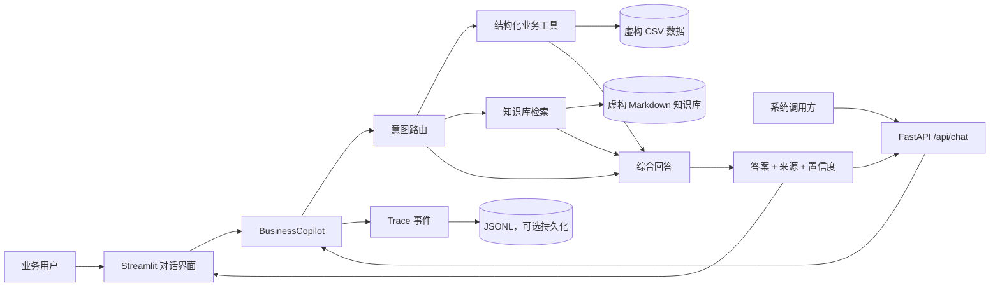
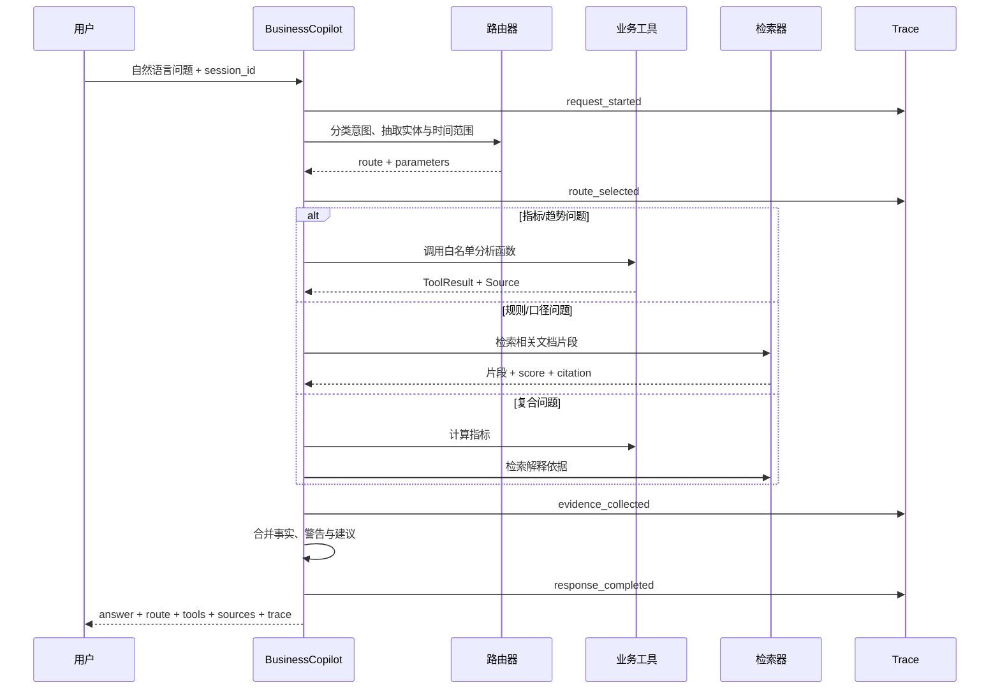

# 架构设计

> 本项目中的组织、产品、客户及经营数据全部为虚构。

## 1. 设计目标

NovaMed AI Business Copilot 面向销售运营、区域负责人和管理层，把自然语言经营问题转成可核验的数据分析。系统重点解决四个工程问题：

- **结果有依据**：数值由业务工具计算，制度类问题由知识库检索，并返回来源。
- **过程可观察**：记录路由、工具、检索、耗时和状态，便于调试与复盘。
- **演示可复现**：默认本地确定性模式，无 API Key 也能跑通核心路径。
- **边界可控制**：只暴露白名单工具；异常时返回明确警告，不编造缺失数据。

## 2. 系统视图



系统是“薄 UI、厚 Agent”结构。Streamlit 和 FastAPI 只负责输入校验与结果呈现，业务编排集中在 `BusinessCopilot`，避免两套入口产生不同答案。

## 3. 一次请求如何执行



输出不是单一字符串，而是稳定的结构化协议：

```json
{
  "answer": "面向用户的结论与建议",
  "route": "sales_analysis",
  "tools": ["sales_summary"],
  "sources": [
    {
      "id": "sales_demo",
      "file": "sales.csv",
      "citation": "销售演示数据",
      "description": "本次汇总使用的虚构记录"
    }
  ],
  "trace": [
    {"event": "route_selected", "route": "sales_analysis"}
  ],
  "confidence": 0.88,
  "metadata": {"mode": "local"}
}
```

字段可以扩展，但前端与 API 不应依赖自然语言文本去反解析来源或执行步骤。

## 4. 组件职责

| 组件 | 职责 | 不负责 |
|---|---|---|
| `frontend/` | 对话、示例问题、KPI、来源和 trace 展示 | 业务计算、路由规则 |
| `api/` | HTTP 输入校验、Agent 生命周期、错误边界 | 重复实现 Agent 逻辑 |
| `app/agent.py` | 编排、上下文、工具选择、答案组装 | 直接修改源数据 |
| `app/tools.py` | 确定性聚合、同比/环比、排序、风险识别 | 自由生成结论 |
| `app/rag.py` | 文档切分、检索、返回引用 | 经营指标计算 |
| `app/trace.py` | 记录可审计执行事件，可选 JSONL 持久化 | 暴露模型私有推理 |
| `evaluation/` | 批量运行案例、计算指标、生成评测结果 | 在线业务监控 |

具体文件可能随实现演进，但职责边界应保持稳定。

## 5. 双模式设计

### Local 模式

- 基于规则做意图路由和实体抽取。
- 业务指标由 Python 工具确定性计算。
- 回答使用模板组织，结果稳定、无需网络、便于单测。
- 是仓库默认模式，也是 CI 和现场面试演示的可靠兜底。

### OpenAI 模式

- 模型负责理解复杂表达、选择白名单工具和综合证据。
- 工具结果仍是事实来源，模型不直接“心算”核心经营指标。
- 缺少 `OPENAI_API_KEY` 时明确失败或退回本地模式，不能静默伪装成云端调用。

双模式不是维护两套产品逻辑：二者共享数据层、工具协议、来源协议、trace 与评测集，只替换决策和表达策略。

## 6. RAG 与工具调用的分工

| 问题类型 | 首选路径 | 原因 |
|---|---|---|
| “本周销量是多少？” | 结构化工具 | 需要精确聚合与过滤 |
| “新品授权规则是什么？” | 知识库检索 | 答案存在于非结构化制度文本 |
| “华东下降原因是什么？” | 工具 + 检索 | 先确认下降事实，再找活动/政策依据 |
| “建议下周怎么做？” | 工具 + 检索 + 综合 | 建议必须引用事实并标注假设 |

原则是：**数据库/代码擅长算的，不交给模型猜；文档中已有的，不依赖模型记忆。**

## 7. 可信度设计

### 来源协议

每个工具结果都携带 `Source`，至少包含唯一标识、文件/文档、引用名和说明。前端按来源卡片展示，而不是把引用埋在回答文本里。

### 置信度

置信度是工程提示，不等于统计学概率。它可以结合以下信号：

- 意图是否明确；
- 参数是否完整；
- 工具是否成功；
- 检索相关度是否超过阈值；
- 多个来源是否一致；
- 是否触发“数据不足”警告。

生产环境应校准置信度，不能仅凭模型自报分数。

### Trace

Trace 记录事件类型、时间、路由、工具名、参数摘要、结果摘要、耗时与状态。它服务于调试、审计和评测；不记录 API Key，也不要求记录完整提示词或个人信息。

## 8. 失败与降级策略

- **问题不明确**：返回缺少的筛选条件，提示用户补充，不默认捏造时间或区域。
- **没有数据**：明确回答“当前筛选无记录”，保留已使用的筛选条件。
- **工具失败**：记录失败事件，对用户返回可行动提示；不把堆栈信息放进答案。
- **检索低相关**：降低置信度并标注“未找到足够依据”。
- **模型不可用**：使用本地模式完成可覆盖问题，或明确说明需要配置密钥。
- **多个来源冲突**：展示冲突和来源，不替用户掩盖口径差异。

## 9. 可扩展性

新增能力时优先扩展协议，而不是在 Agent 主函数中堆条件分支：

1. 以纯函数实现新工具，并为输入/输出建立类型约束。
2. 为工具结果附上来源和警告。
3. 在路由白名单中注册能力。
4. 给本地与模型路径增加相同的黄金案例。
5. 验证前端无需改动即可展示来源和 trace。

若进入生产，可进一步引入数据库只读账号、向量数据库、队列、集中式日志、OpenTelemetry、权限过滤和审批节点。演示仓库刻意保持轻量，以便理解和复现。
