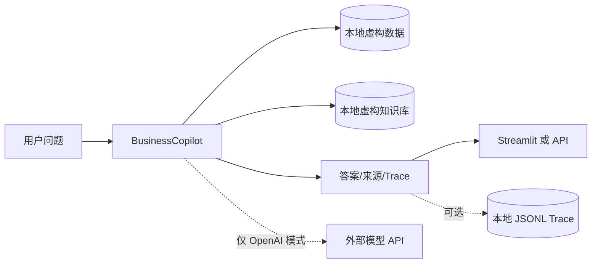

# 数据、隐私与安全说明

## 1. 演示数据声明

本仓库中的 NovaMed、组织结构、产品名称、客户/机构、政策、销售、库存、价格及所有经营指标均为虚构或合成，仅用于技术演示。它们不对应真实公司、真实患者、真实医疗机构或真实商业合同。

项目不需要、也不应加入：

- 真实姓名、手机号、邮箱、证件号、地址等个人信息；
- 病历、诊断、用药、基因等健康或患者信息；
- 未公开客户名单、合同、价格、销量、库存或预测；
- API Key、访问令牌、数据库密码或内部 URL；
- 来自原雇主且没有公开授权的文档或代码。

如果未来替换为真实企业数据，必须先完成独立的安全、法务与隐私评审，不能把演示方案直接视为生产方案。

## 2. 当前数据流

默认 Local 模式可以不把问题和数据发送给外部模型。OpenAI 模式开启后，具体发送内容取决于 Agent 实现与工具编排；使用者应在运行前理解并接受相应的数据处理条款。

## 3. 凭据管理

- 只通过环境变量或正式密钥管理服务提供 `OPENAI_API_KEY`。
- `.env.example` 只能放变量名和空值，不放真实凭据。
- 日志、trace、测试快照和异常信息不得包含完整请求头或密钥。
- 不把密钥传给工具参数，也不返回到前端。
- 一旦误提交凭据，应立即轮换，而不是只删除 Git 中的文件。

前端在展示 trace 前会对常见凭据字段做遮盖；这只是第二道防线，源头仍然不应记录敏感值。

## 4. Trace 与日志策略

Trace 用来回答“系统做了什么”，而不是记录一切。建议保留：

- trace id、session id 的随机标识；
- 时间、模式、路由、工具名、状态和耗时；
- 已脱敏的参数摘要、结果摘要和 source id；
- 错误类型，不含原始密钥和完整堆栈。

建议避免：

- 模型私有思维过程；
- 完整 API 请求头；
- 无必要的完整用户输入；
- 整份原始文档和数据库记录；
- 能直接识别真实个人或客户的字段。

演示版的 JSONL trace 存储在本地并可关闭。生产环境需要定义用途、访问人、加密方式、保存期限和删除机制。

## 5. 主要威胁与控制

| 威胁 | 演示版控制 | 生产化补充 |
|---|---|---|
| Prompt injection | 工具白名单、数据/指令分离、拒绝索要秘密 | 内容隔离、策略引擎、对抗评测 |
| 越权数据访问 | 仅本地虚构数据 | 行级/列级权限、租户隔离、用户身份传递 |
| 工具滥用 | 只读分析工具、明确 schema | 最小权限、审批、速率限制、执行沙箱 |
| 敏感信息泄露 | 不含真实敏感数据、trace 字段遮盖 | DLP、输出过滤、审计告警 |
| 间接提示注入 | 文档只当数据，不当系统指令 | 检索内容标记、来源信任级别、隔离解析 |
| 数据投毒 | 固定演示数据和测试 | 数据血缘、签名、变更审批、异常检测 |
| 幻觉 | 工具计算、RAG 引用、低证据降级 | 置信度校准、人工审批、在线监控 |

## 6. 生产环境最小权限原则

如果连接真实数仓或 CRM，Agent 使用独立服务账号并默认只读。它只应访问完成当前用户任务所需的行、列和时间范围。用户在源系统没有权限的数据，Agent 也不能通过“智能回答”绕过。

任何写操作都应采用：

`生成建议 → 展示变更预览 → 人工确认 → 权限校验 → 幂等执行 → 审计记录`

演示项目不实现自动写回，因此也不应在面试时描述成已具备生产写权限。

## 7. 数据生命周期

生产化前需要明确：

1. 输入是否被保存，保存多久；
2. 模型提供方是否保留或用于训练；
3. embedding 和缓存中是否存在敏感内容；
4. 用户如何查询、更正或删除相关记录；
5. 备份与 trace 到期后如何删除；
6. 跨境、区域合规和供应商责任如何落实。

建议为开发、测试、生产使用不同数据和凭据。测试尽量使用合成数据；若必须使用抽样生产数据，先最小化、脱敏并获得授权。

## 8. 使用者须知

- 输出用于分析辅助，不替代有权限人员的最终判断。
- 来源卡片能提高可核验性，但不自动保证结论正确。
- 医疗、法律、财务或人事等高风险决策必须由相关专业人员复核。
- 发现异常来源、敏感信息或越权结果时，应停止使用并报告，而不是继续扩散输出。
